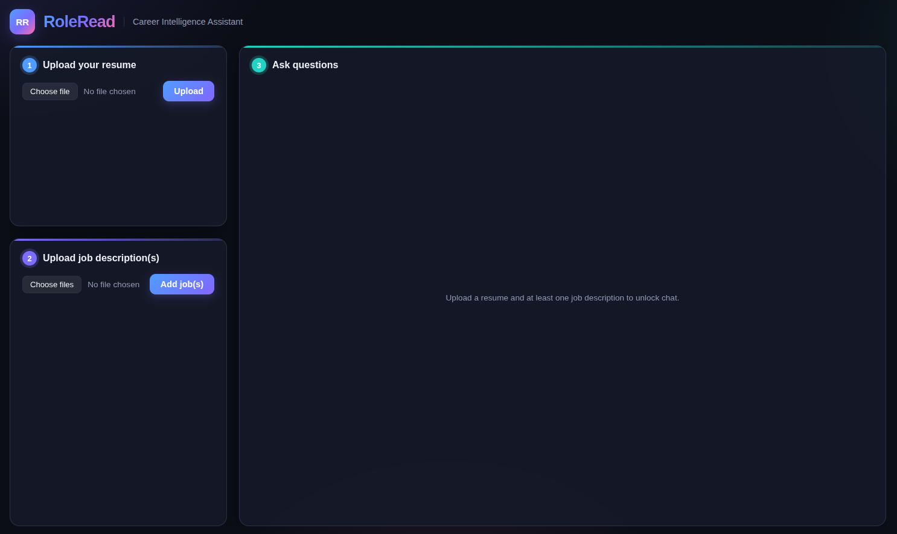
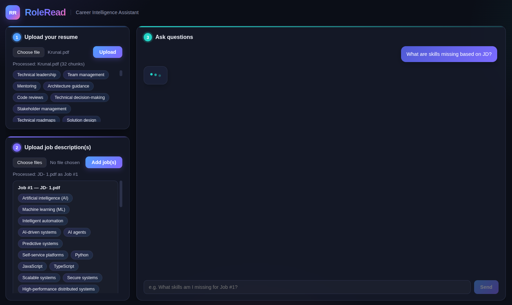
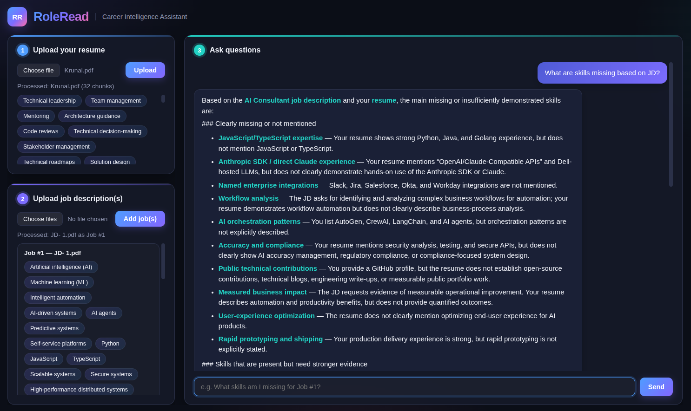

# RoleRead — Career Intelligence Assistant

RoleRead is a RAG-based assistant: upload your resume and one or more job descriptions,
then chat about fit, skill gaps, experience alignment, and interview preparation.

The core design idea: skill-gap matching is computed **deterministically in Python**
(never left to an LLM to eyeball), while the headline "Overall Fit Score" and open-ended
questions (should I apply? how do I prepare for an interview?) are handled by the LLM as
clearly-labeled qualitative judgment, grounded in those verified facts plus the full
resume/job text. Section [d](#d-ragllm-approach--decisions) and
[e](#e-key-technical-decisions) below go into why.

---

## a. Quick setup

### Option 1 — Docker (recommended)

```bash
cp backend/.env.example backend/.env
# edit backend/.env and set OPENAI_API_KEY=sk-...

OPENAI_API_KEY=sk-... docker compose up --build
```

Open `http://127.0.0.1:8420/`. Chroma data persists in a named Docker volume
(`chroma_data`) across restarts.

### Option 2 — Local Python

```bash
cd backend
python3 -m venv .venv
source .venv/bin/activate
pip install -r requirements.txt

cp .env.example .env
# edit .env and set OPENAI_API_KEY=sk-...

uvicorn app.main:app --reload --port 8420
```

Open `http://127.0.0.1:8420/`. FastAPI serves the frontend directly as static files — no
separate frontend build/server.

Run tests: `pytest` (from `backend/`, 32 tests, no network calls).

### How to use

1. **Upload your resume** (PDF, TXT, or MD).
2. **Upload one or more job descriptions** (up to 5).
3. **Ask questions**, e.g. "What skills am I missing for Job #1?", "How does my experience
   align with Job #2?", "Give me a detailed comparison for Job #1", "Help me prepare for
   an interview."

### Screenshots

| Empty state | Documents uploaded, thinking | Answer with citations |
|---|---|---|
|  |  |  |

---

## b. Architecture overview

```
Browser (session_id in localStorage → sent as X-Session-Id header)
        │
        ▼
┌──────────────────────────────────────────────────────────────────┐
│                          FastAPI Backend                          │
│   POST /resume     POST /jobs     POST /chat      GET /health     │
└───────────────────────────┬────────────────────────────────────--┘
                             │
                             ▼
   Per-session upload pipeline (session isolated by session_id):
     parse (pdf/txt/md) → extract {document_type, summary, skills[]} via LLM
       → reject if document_type doesn't match what was uploaded (e.g. an
         invoice uploaded as a "resume")
       → chunk (LangChain splitter) → embed → upsert into this session's
         own Chroma collection ("career_<session_id>")
       → skills embedded once and cached on the document
                             │
                             ▼
   POST /chat:
     1. resolve_job_scope()      → which job(s) this question is about
     2. rewrite_query_for_retrieval() → handles short pronoun follow-ups
     3. retrieve()                → vector search + BM25 rerank (RRF) —
                                     used for the scope-lock guardrail and
                                     citation snippets only
     4. compute_gap_analysis()    → deterministic string/alias skill match
     5. add_semantic_matches()    → embedding fallback for leftover skills
                                     ("possibly related", never merged into
                                     confident matches)
     6. build prompt: guardrails + history + skill-gap facts (internal
        context, not shown by default) + full resume/job text
     7. chat model → holistic "Overall Fit Score" + answer + citations
```

**Isolation model**: every browser gets an anonymous UUID `session_id`. Each session has
its **own Chroma collection**, not a shared collection with a metadata filter — cross-
session data leakage is structurally impossible, not just "usually filtered correctly."
Session state itself (resume/job docs, conversation history) is in-memory, so it doesn't
survive a server restart — a known, deliberate scope cut (see section h).

**Backend layout** (`backend/app/`):

| File | Responsibility |
|---|---|
| `main.py` | FastAPI app, CORS, global error handlers, static frontend mount |
| `api.py` | Routes: upload validation, upload-type rejection, chat orchestration |
| `session.py` | Per-session isolation, `resolve_job_scope` (single vs. multi-job questions) |
| `config.py` | Centralized settings (`pydantic-settings`, `.env`-driven) |
| `ingestion.py` | Parse → chunk pipeline |
| `llm.py` | All OpenAI calls: embeddings, chat, structured extraction + classification |
| `gap_analysis.py` | Pure, deterministic skill-diff logic — no network calls |
| `retrieval.py` | Vector top-k + BM25 hybrid rerank |
| `conversation.py` | Fixed-window history, retrieval query rewriting for follow-ups |
| `chat.py` | Prompt composition, guardrails, scope-lock refusal |

A per-file deep-dive (what each file does, why, and likely questions about it) exists in
my local dev notes but isn't included in this repo — happy to walk through any file live.

---

## c. Productionizing / scaling on a hyperscaler

Built for a short timeline with deliberate scope cuts (see section h). To productionize
on AWS/GCP/Azure/Cloudflare, in priority order:

1. **Externalize session state to Redis** (ElastiCache / Memorystore / Azure Cache) with
   TTL expiry — it's currently an in-process dict, so it's lost on restart and can't run
   behind more than one instance. This unblocks everything else below.
2. **Move Chroma to a hosted/managed vector store** (or Postgres + pgvector) — the
   embedded mode used here has no backup/replication story at real scale.
3. **Containerize and deploy to a managed runtime** — Docker setup already exists
   (`backend/Dockerfile`, `docker-compose.yml`); Cloud Run / ECS Fargate / Container Apps
   is enough at this size, no need for full Kubernetes yet.
4. **Put a CDN/API gateway in front** (CloudFront/ALB, Cloud CDN, or Cloudflare) — TLS,
   rate limiting, DDoS protection, and serving the frontend from an edge cache.
5. **Add real authentication** (Cognito/Auth0/Firebase) instead of an anonymous
   session-id-in-localStorage model, so data survives across devices.
6. **Move the API key to a secrets manager** (AWS/GCP/Azure) instead of a `.env` file.
7. **Ship logs and add tracing** — structured logs already exist; next step is a real
   log sink (CloudWatch/Cloud Logging) plus OpenTelemetry tracing and latency/error
   dashboards.
8. **Scale horizontally once state is externalized** — the app itself is stateless at
   that point; OpenAI API calls are the actual cost/latency bottleneck, not app logic.
9. **Add CI/CD** — GitHub Actions running the test suite on every PR, then building and
   deploying the image; currently all manual.
10. **Add rate limiting / cost controls per session or IP** — currently unbounded besides
    the 5-job-per-session cap.

---

## d. RAG/LLM approach & decisions

| Area | Choice | Why (one line) |
|---|---|---|
| **Chunking** | LangChain splitter, 500 chars / 50 overlap | Short docs → small chunks keep retrieval precise |
| **Embedding model** | `text-embedding-3-small` | Best cost/quality fit for short documents |
| **Vector DB** | Chroma, embedded, one collection per session | Zero-ops setup; per-session collections make isolation structural, not a filter to remember |
| **LLM** | `gpt-5.6-luna` (via `.env`) | Newer reasoning model, ~3x cheaper than `gpt-4o`, holds up well on benchmarks — see section e for the migration bug |
| **Orchestration** | LangChain for chunking only; rest is plain Python | One well-defined LLM call per turn didn't need a heavier agent framework |
| **Retrieval** | Vector + BM25 hybrid, used only for guardrail checks and citations | No natural "search query" exists for holistic questions — those get the full document text instead |
| **Extraction** | One structured call returns type classification + summary + skills | Same cost as a skills-only call, richer output |
| **Prompt/context** | Separate `<conversation_history>`/`<skill_gap_facts>`/`<context>` blocks | Clear boundary between instructions, facts, and untrusted document text (prompt-injection defense) |
| **Guardrails** | Retrieval-score refusal, no tools/actions wired up, no internal-detail disclosure | The refusal gate doesn't depend on the LLM behaving; the rest is reinforced structurally where possible |
| **Quality controls** | Deterministic skill diff + a "false friends" guard (e.g. Java vs. JavaScript) + content-based upload validation | The most fact-checkable question needed to be verifiable, not guessed |
| **Observability** | Structured logs (session id, latency, outcome) + a global error handler | Enough to actually debug real issues during dev — no tracing/dashboards yet (see section c) |

---

## e. Key technical decisions

- **Deterministic skill matching, LLM only narrates it** — `gap_analysis.py` is plain
  Python set logic (alias map + embedding fallback); the LLM explains the result, never
  computes it, since that's the claim most likely to get fact-checked.
- **Holistic fit score, not the literal keyword score, as the headline number** — the
  literal score read far lower than a human's impression (11-18% vs. ~80% from ChatGPT)
  because differently-worded-but-equivalent experience doesn't clear a string/embedding
  bar. The LLM now gives one recruiter-style percentage; the literal numbers still exist,
  just not volunteered by default.
- **Content-based upload validation** — extension checks alone don't stop someone
  uploading an invoice as a "resume," so the extraction call also classifies actual
  content and rejects a confident mismatch (staying lenient when it's unsure).
- **Per-session Chroma collections, not a shared collection with a filter** — a filter can
  be forgotten in some future query path; a separate collection per session makes
  cross-session leakage structurally impossible instead.
- **A reasoning-model compatibility bug** — switching to `gpt-5.6-luna` broke immediately
  because reasoning models reject any explicit `temperature`, which the old code always
  passed; fixed by detecting reasoning models and omitting it. Only caught by smoke-testing
  a real API call, not from the (offline) unit tests.
- **A stale-config bug worth calling out** — a recalibrated similarity threshold was
  updated in the code default but not in the actual `.env` file being used, so the app
  silently ran the old, too-strict value until I reproduced the pipeline offline and the
  numbers gave it away.

---

## f. Engineering standards followed (and skipped)

**Followed:**
- Modular backend, one responsibility per file — no giant `main.py`.
- Deterministic core (`gap_analysis.py`) kept as pure functions — no network calls, easy
  to unit-test with synthetic inputs.
- 32 offline tests — pure-function tests plus `TestClient` + `monkeypatch`-stubbed LLM
  calls, with a broken placeholder API key so any unmocked call fails loudly.
- Centralized typed config (`pydantic-settings`) instead of scattered env-var reads.
- Structured logging with consistent fields (session id, latency, outcome).
- Global exception handlers so failures return clean responses, never raw tracebacks.
- Input validation at every upload boundary — extension, size, non-empty, content type.
- Clean `.gitignore` — secrets and local data never committed.
- Docstrings that explain *why*, not just *what*, on the non-obvious trade-offs.

**Skipped (honestly):**
- **No CI** — tests run locally only, not gated on push/PR.
- **No linter/formatter/type checker** (`ruff`/`black`/`mypy`) — style is consistent by
  hand, not tooled.
- **No dependency pinning** — version ranges, not a lockfile.
- **No rate limiting** — a session could hammer the API endlessly.
- **In-memory session state** — the biggest accepted cut; see section c for the fix.

---

## g. How I used AI tools in my development process

*(My own account, written after the fact — not AI-generated.)*

I used Devin CLI as an AI pair-programmer throughout, not as an autocomplete-and-accept
tool. In short:

- **I drove every real decision** — the scoring split, the fit-score redesign, the model
  choice — the AI implemented, tested, and occasionally pushed back with a trade-off I
  hadn't considered.
- **I verified instead of trusting** — when something looked off, I had it reproduce the
  issue with real data/API calls; that's how both real bugs (stale threshold, reasoning-
  model incompatibility) actually got found.
- **Do**: use it for fast plumbing, exploring options (e.g. real model pricing/benchmarks
  before choosing one), and writing tests alongside every change.
- **Don't**: accept a fix I don't understand, or let it quietly decide something that
  should be my call.
- **For repeatability**: reasoning lives in code comments and this README, not just in
  chat history — it holds up independent of any one session.

---

## h. What I'd do differently with more time

- Persist session state (Redis/Postgres, TTL expiry) and add real authentication.
- Replace string-concatenation follow-up handling with a proper LLM query-rewrite step.
- Wire up real tracing/metrics instead of logs alone.
- Build a more robust, fuzzy synonym/false-friends match instead of a hand-picked list.
- Add CI plus a linter/formatter/type checker.
- Do more prompt-injection and adversarial-input testing.
